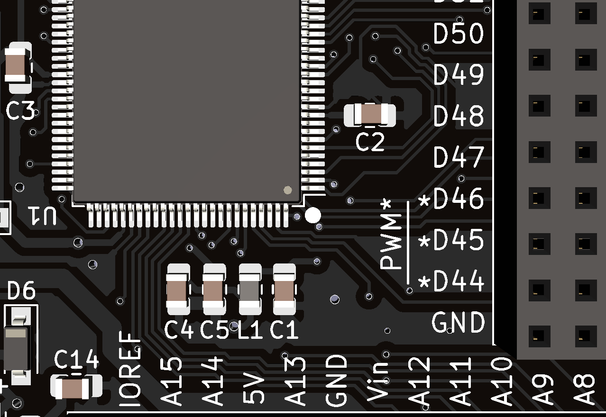
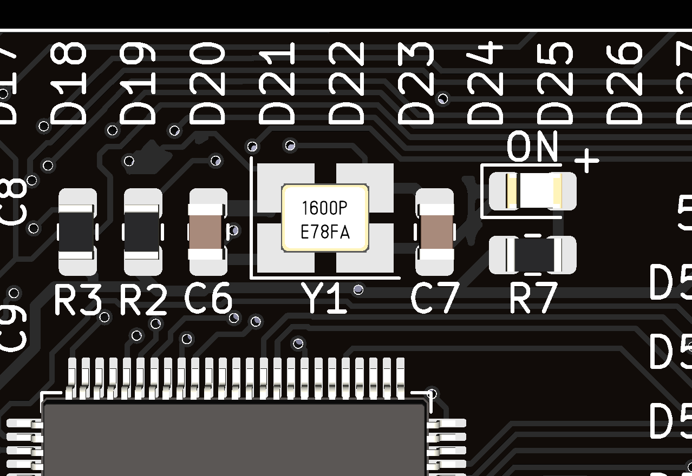
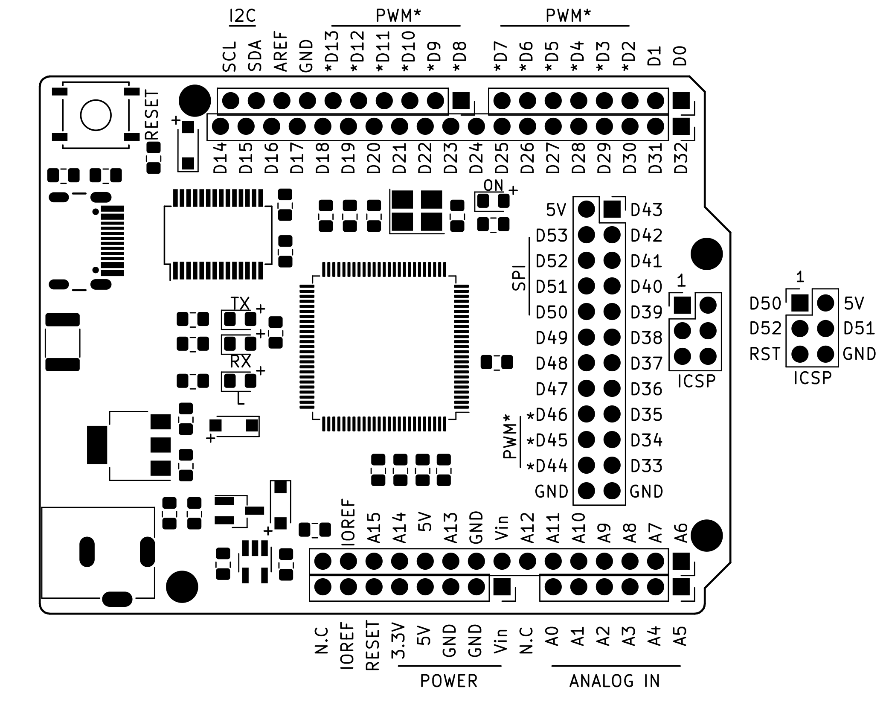
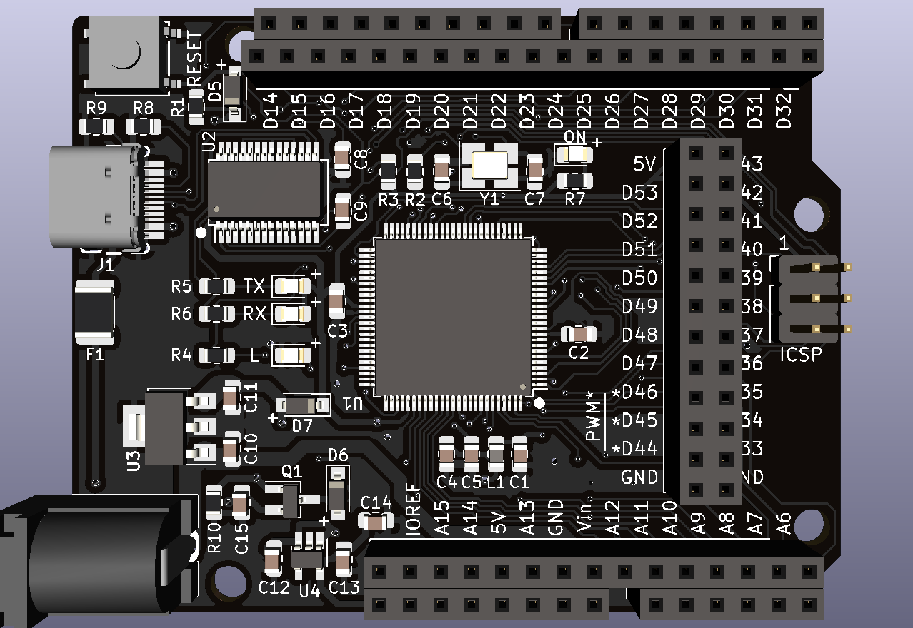

# Menoの組み立てからブートローダの書き込みまで
## 必要なもの
* 部品
* ハンダごてorヒートガン (もしくは両方) ※1
* Arduino Uno (互換機でも可)
* USBケーブル - 2本 (Uno用のType-BケーブルとMeno用のType-Cケーブル)
* ジャンパ線 - 6本 (オスオスのもの)
* 多少の電子工作知識とハンダ付けの腕
* ~あきらめない気持ち (重要)~

※1: 参考としてHAKKO製ヒーティングガン FV-310-81の例では```風量調節ツマミは1(0.15m^3/min) or 2(0.17m^3/min)で、温度調節ツマミが3(245℃ or 230℃)```になるよう調節するとヒートガンでもハンダ付けが行えると思われます。

## 部品を入手する
* まず部品を[部品表](https://github.com/zer0ohm/meno/tree/master/Meno/Docs/Meno_BOM.pdf)に従って入手していきます。(※今回は秋月電子通商とDigikeyで入手しましたが、その他の店舗で入手できる場合はそちらでも構いません。)

## ハンダ付け
* 1.で入手した部品を、先程の[部品表](https://github.com/zer0ohm/meno/tree/master/Meno/Docs/Meno_BOM.pdf)と基板上の部品番号(例: ATmega2560 → U1)に従ってハンダ付けを行います。

### チップ抵抗(R1～R10)・コンデンサ(C1～C15)、フェライトビーズ(L1)、ヒューズ(F1)
* いずれも極性(※1)はありません。しかし抵抗には抵抗値を表す3桁の数字が書かれており、真上から見て読みやすい方向に実装することをおすすめします。
  * ※1: 今回使用するコンデンサは全てセラミックコンデンサですが、コンデンサの種類によっては極性がありますのでよく確認してから実装して下さい。

### ダイオード・LED(D1～7)
* ダイオードの端に縦線、もしくは緑色の目印がある端子側がカソードになっています。また基板上にはアノード側に「+」のシルクを設置しています。目印とシルクを合わせ正しい向きになるよう実装して下さい。(図1参照)
<div align="left"></div>
図1: ダイオードのアノードを示す目印("+"側がアノード)

### USBコネクタ(J1)
 * 部品の構造上、手ハンダが難しい可能性があります。その場合は予めランドにペーストハンダを塗っておき、その上に部品を置いてからヒートガンで実装する方法があります。(図2参照)
 <div align="left"></div>
 図2: USBコネクタの端子

### IC(U1~4)
* U3の三端子レギュレータのような正しい向きでないと物理的に実装できないものを除き、ICの1番端子付近に白丸のシルクを設置しています。IC側の目印(丸や切り欠き)とシルクを合わせ正しい向きになるよう実装して下さい。(図3参照)
<div align="left"></div>
図3: ICの向きを示す目印(IC側の小さな丸とシルク側の白丸を合わせる)

### 水晶振動子(Y1)
* 水晶振動子は数字が逆にならない用に実装して下さい。(図4参照)
<div align="left"></div>
図4: 水晶振動子の設置方向(白丸が4番目の端子)

### ピンソケット・ヘッダ(基板上に部品番号記載なし)
* ピンソケットやピンヘッダは分割型になっています。それぞれ2x19(リセットスイッチ側のソケット)、2x15(DCジャック側のソケット)、2x12(ICSPの隣)、2x3(シルクで「ICSP」と書いてあるところ)となるように手やニッパーなどで分割して下さい。(図5参照)
 * なおピンソケットの場合はメス側(ジャンパ線を刺す方)を上に、ピンヘッダの場合はオスの長い方(黒いプラスチックが表側に来るように)を上にして下さい。

<div align="left"></div>
図5: [参考]Menoのピン配置図

### ハンダ付けが終わった基板
* 一通りハンダ付けが終わった基板を次に示します。
<div align="left"></div>
図6: ハンダ付けした基板

## ブートローダを書き込む
* まず用意したArduino Uno(以下、プログラマ)にArduinoISPのスケッチを書き込みます。
  * 場所は ```ファイル>スケッチ例>11.ArduinoISP>ArduinoISP```です。
* 次にプログラマとMeno(以下、ターゲット)を表やピン配置図(図5参照)の通りにジャンパ線で配線します。

|プログラマ  |ターゲット |
|---------|---------|
|5V       |5V       |
|GND      |GND      |
|D10      |RESET    |
|D11      |D51      |
|D12      |D50      |
|D13      |D52      |

表1 プログラマ/ターゲットのピン変換表

* ボードやシリアルポートを指定します

|設定名      |値                                       |
|----------|-----------------------------------------|
|ボード      |Arduino Mega or Mega 2560               |
|プロセッサ   |ATmega2560 (Mega 2560)                  |
|シリアルポート|プログラマが接続されているシリアルポート (例:COM4) |
|書込装置     |Arduino as ISP                          |

表2 ターゲットの設定

* 「ブートローダを書き込む」をクリックします

* ブートローダの書き込みに成功すると実装したLED(「L」と書かれたLED)が1秒毎に点灯します。あとは他のArduinoボードと同じ様にコンパイルと書き込みでスケッチを書き込むことができるようになります。その際は次の通りに設定してから書き込みを行って下さい。

|設定名      |値                                       |
|----------|-----------------------------------------|
|ボード      |Arduino Mega or Mega 2560               |
|プロセッサ   |ATmega2560 (Mega 2560)                  |
|シリアルポート|ターゲットが接続されているシリアルポート (例:COM4)|

表3 オリジナルのスケッチを書き込む時の設定
